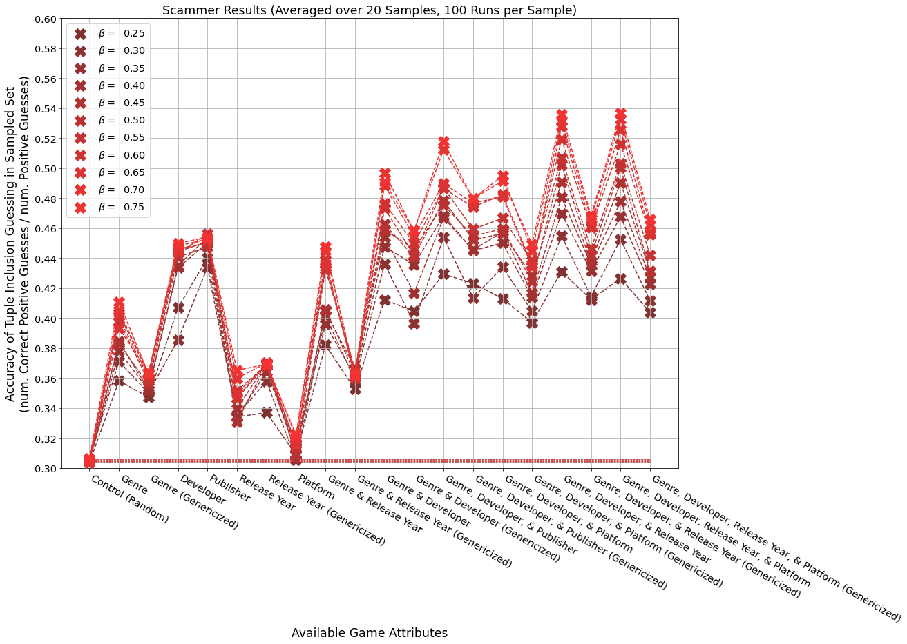
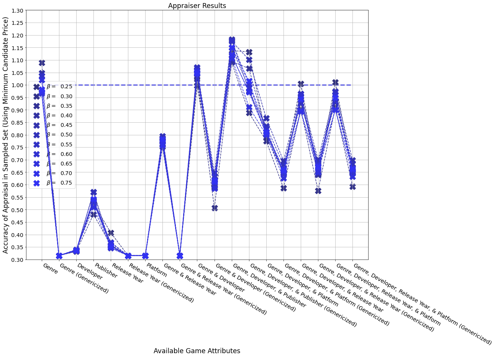

---
title:
- Trustworthy ML Project - Practical Methods of Inventory Anonymization and Privacy
author:
- Charles Cook
theme:
- CambridgeUS
header-includes:
- \logo{\includegraphics[width=0.6667cm]{rpilogo.png}}
- \usepackage{caption}
- \captionsetup{labelformat=empty}
- \setbeamerfont{caption}{size=\scriptsize}
date:
- April 6th, 2022
institute:
- Rensselaer Polytechnic Institute

---

# Motivation: A Trader's Life

* Virtual Marketplaces are burgeoning environments of commerce
	* ex. Steam (TF2/CSGO Item Trading)
* Curators of rare/valuable items in these marketplaces are often bothered and accosted regularly by Scammers
	* Scammers seek to con Curators out of their items, or hijack their accounts totally
	* Aggravated if the Curator's inventory is publicly visible
		* ex. Only options are Steam are Public, Friends Only, or Private
* Curators who engage in trading often need to publicly display their Inventory, but this can bring negative attention

* **How can Curators present their Inventory in such a way to minimize Scammer attention but maintain status with trading Appraisers?**

# Problem Statement: Games Dataset 

* The combined techniques of $k$-Anonymization and $\beta$-Sampling *(Li et. al., 2012)* can achieve Differential Privacy *(Dwork, 2006)*
	* Recap: D.P. **protects** individual **identities** in a dataset while **maintaining** some level of **utility**

* Experimental Dataset: NES \& SNES video games
	* Sensitive Attributes: **Title**, **Price**
	* Quasi-Identifies: **Genre**, **Developer(s)**, **Publisher(s)**, **Release Year**, **Platform**
		* *(had to manually add in (estimated) Prices and Genres)*
	* Superset of 223 total titles *(Items of interest)*
		* *(total of over 1,000 on Wikipedia's lists)
	* Collection set of 68 titles in Curator's *Inventory*
	* Collection/Interest Ratio of ~$30.5\%$

# Game Dataset Pretty-Printed

# Problem Statement: Inventory Anonymization

* Anonymization Through **Suppression** \& **Generalization**
	* Title \& Price always withheld, optionally one or more QIs as well
	* Also optionally, Genre despecified \& Release Year turned into Release Decade
		* 10 specific Genres to 3 Super-Genres
	* $k$-Anonymous level is computed after Suppression/Generalization, not set as a target
	* **Hypothesis/Heuristic**: Higher $k$-Levels mean both Scammer \& Appraiser do worse
		* We want to balance this such that Scammer does bad but Appraiser does good

* Sampling of Anonymized Inventory
	* 25\% to 75\%, 5\% increments

* Publish Sampled-Anonymous Inventory, Size (Cardinality) of Inventory, and full Interest Superset
	* Possibly leave inference of Superset up for Scammer/Appraiser to do

# Anonymization Statistics: $k$-Levels

{width=88%}

# Metric 1: Scammer Deanonymization

* Scammer tries to identify if games are in the Inventory based on Samp.-Anon. set

* **Scammer Algorithm**
	* Anonymize the Interest Superset to match public attributes in Samp.-Anon. set
	* On all games in anonymous Interest Superset:
		* Flip a coin
		* Guess (proportionally) randomly on heads
		* On tails, compare proportions on the game between superset and sampled set
		* Guess **yes** if game occurs as much or more in sampled set against superset
	* Present guesses when done to an oracle, learn ratio of correct **yes** guesses to all **yes** guesses
		* *(Proportionally random: number of yes guesses equal to size of Inventory (see Ratio two slides back))

# Scammer Results

{width=90%}

* Drew 20 samples per $\beta$ value, each anonymized in many ways independently
* Each anonymization run 100 times by Scammer, accuracies averaged
* Control is fully random guessing

# Metric 2: Appraiser Valuation

* Appraiser tries to compute the Full Value of the Inventory based on Samp.-Anon. set

* **Appraiser Algorithm**
	* Anonymize the Interest Superset to match public attributes in Samp.-Anon. set
	* On all games in Samp.-Anon. set:
		* Find all matching games in  Interest Superset
		* Record the **minimum price** of matching games as Candidate Price
	* Compute the sum of all Candidate Prices
	* Multiply Candidate Price Sum by ratio of size of Inventory to Samp.-Anon. set
	* Present Scaled Candidate Price Sum to an oracle, learn ratio of prior to Actual Price Sum

# Appraiser Results

{width=90%}

# Results Side-By-Side

{width=90%}

# Conclusions \& What Is To Be Done

* With a maximum of $+15%$ Scammer Accuracy
	* (**Genre**) \& (**Genre**, **Release Year**) maximize Appraiser Accuracy irrespective of $\beta$
	* **Genre** alone is the best
		* *(both without Generalization, only Suppression)*
* (**Genre**, **Developer(s)**) is also desireable if $\beta$ is kept well below $0.5$
* $k$-Level clearly related to utility of Scammer/Appraiser, but not alone decisive

* As mentioned in Motivation, using Steam items (TF2 Unusual Hats, CSGO Knives, etc) would yield larger inventories
	* Results could be less affected by small $k$-Levels
	* What would be analogous attributes to Genre \& Developer?

* Github link: **[https://github.com/cSquaerd/inventoryAnonProject.git](https://github.com/cSquaerd/inventoryAnonProject.git)**

# Bibliography

* **[1]** Ninghui Li, Wahbeh Qardaji, and Dong Su. 2012. On sampling, anonymization, and differential privacy or, k-anonymization meets differential privacy. In *Proceedings of the 7th ACM Symposium on Information, Computer and Communications Security (ASIACCS '12)*. Association for Computing Machinery, New York, NY, USA, 32–33. DOI:https://doi.org/10.1145/2414456.2414474
* **[2]** Latanya Sweeney. 2002. Achieving k-anonymity privacy protection using generalization and suppression. *Int. J. Uncertain. Fuzziness Knowl.-Based Syst.* 10, 5 (October 2002), 571–588. DOI:https://doi.org/10.1142/S021848850200165X

* **[3]** Cynthia Dwork. 2006. Differential privacy. In *Proceedings of the 33rd international conference on Automata, Languages and Programming - Volume Part II (ICALP'06)*. Springer-Verlag, Berlin, Heidelberg, 1–12. DOI:https://doi.org/10.1007/11787006_1

# EOF
